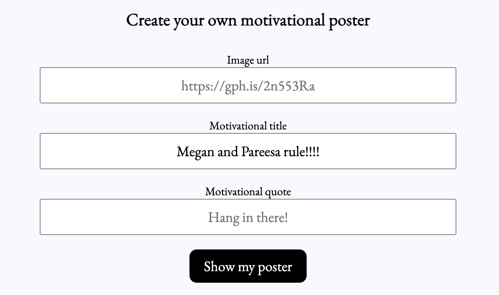

# Hang in There  

### Abstract:
We built a web application that allows you to either generate a random motivational poster or create one yourself by choosing an image and a quote and a title, save the poster (whether it is randomly generated or custom made) to a designated page without saving duplicates, and double click on a saved poster to delete it from the saved-posters page. 

### Installation Instructions:
1. Fork this repo and copy the SSH Key
2. Navigate to terminal and run `git clone SSH key`
3. Type `cd ticTacToe` in local terminal to navigate to root directory
4. Type `code .` to open the directory in text editor, or simply type `open index.html` to open the web application
   
### Preview of App:

### Context:
We have been coding Javascript for about 2 weeks, and HTML/CSS for about one week. We spent an average of 7 hours a day of worktime for 4 days, for a total worktime of about 30 hours. 

### Contributors:
[Pareesa Kamgar-Dayhoff's GitHub](https://github.com/pareesakd1118)
[Megan Crotteau's GitHub](https://github.com/crotteau)

### Learning Goals:
- Write clean, DRY JavaScript
- Build out functionality using functions that show trends toward SRP
- Manipulate the page after it has loaded adding, removing, and updating elements on the DOM
- Begin to understand the connection between HTML, CSS and JavaScript
- Practice reading, understanding, and using provided code
- Build an understanding of writing code collaboratively
- Document changes with atomic commits & thorough code reviews
- Communicate, troubleshoot, and plan effectively as a team
- Ensure all team members are able to be heard and contribute throughout the project

### Wins + Challenges:
The biggest wins were figuring out how to delete entire posters by double clicking anywhere on the poster. Initally, our code was written such that only certain elements of the poster would be deleted (e.g. title, image, quote). We did a lot of online research and discussing with classmates to find that you can bubble up to ancestor elements, to remove entire container elements. Another major win was understanding how to use the data model to update the DOM, and the relationship between the two. 
